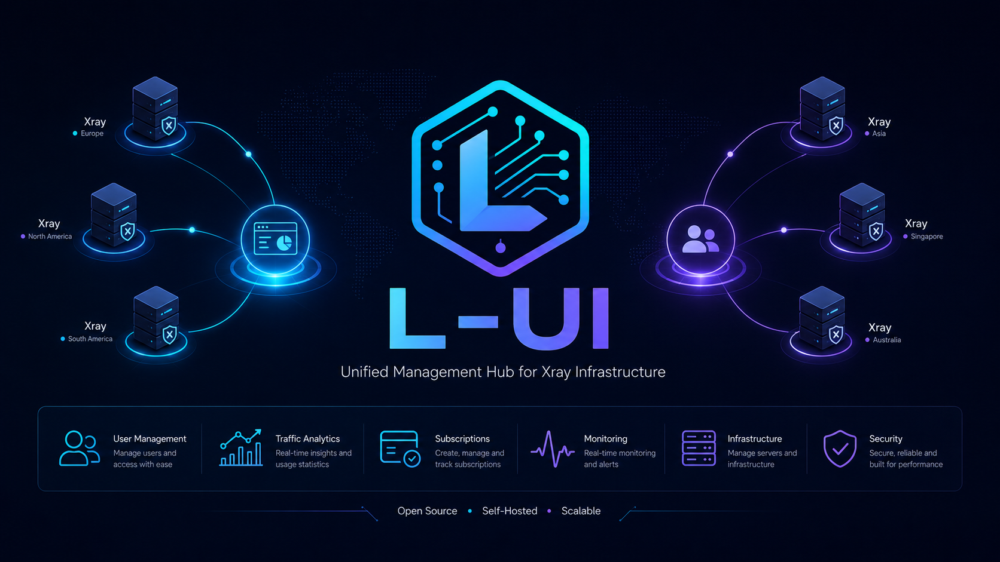

[English](/README.md)

<h1 align="center">L-UI</h1>
<h3 align="center">One Dashboard. Multiple Xray Panels.</h1>

<p align="center">
  <a href="https://github.com/drunkleen/l-ui/actions/workflows/ci.yml"></a>
  <a href="https://github.com/drunkleen/l-ui/releases"></a>
  <a href="https://pkg.go.dev/github.com/drunkleen/l-ui"></a>
  <a href="https://goreportcard.com/report/github.com/drunkleen/l-ui"></a>
</p>

L-UI is a **control-plane dashboard** for managing remote VPS nodes and their Xray instances. The hub does not run Xray itself — it provisions nodes over SSH, installs a lightweight agent, and controls nodes through HMAC-signed HTTP APIs.

<p align="center">
  
</p>

## Architecture

```
┌────────────┐     SSH/SCP       ┌──────────────┐
│            │ ────────────────> │              │
│   HUB      │     bootstrap     │   AGENT      │
│  (Fiber)   │                   │  (Fiber)     │
│            │ <──────────────── │              │
│            │  HMAC-signed HTTP │   runs Xray  │
│ SQLite/    │   api/v1/*       │              │
│ Postgres   │                   └──────────────┘
│            │
│ React 19   │
│ Ant Design │
└────────────┘
```

- **Hub** — Go + Fiber v3 backend with embedded React 19 + Ant Design 6 frontend. Manages nodes, inbounds, clients, routing, and assignments. Stores data in SQLite / Postgres / MySQL. Never runs Xray.
- **Agent** — lightweight standalone binary deployed to each VPS node. Exposes a management API signed with HMAC-SHA256. Runs and manages Xray locally.
- **Frontend** — single-page React 19 app built with Vite, embedded into the hub binary.

## Repo Structure

| Directory | Purpose |
|-----------|---------|
| `hub/` | Hub server: Fiber v3 controllers, services, cron jobs, embedded frontend |
| `agent/` | Standalone lightweight agent binary deployed to remote VPS nodes |
| `internal/` | Shared packages: config, database models, auth (JWT/HMAC), SSH utils, bundle, UFW, retry |
| `xray/` | Xray core primitives: config structs, process management, gRPC API client |
| `frontend/` | React 19 + Ant Design 6 admin panel (multi-entry Vite app) |
| `docs/` | Architecture, install, bootstrap, API, and troubleshooting docs |
| `hub/web/dist/` | Generated frontend build, embedded into the hub binary |

## Quick Start

```bash
bash <(curl -Ls https://raw.githubusercontent.com/drunkleen/l-ui/master/install.sh)
```

## Development

| Command | Purpose |
|---|---|
| `make dev` | Start Go backend then Vite with local `./tmp` runtime files |
| `make build` | Build frontend bundle and both Go binaries (hub + agent) |
| `make build-hub` | Build the hub binary only |
| `make build-agent` | Build the agent binary only |
| `make test` | Run backend + frontend tests |
| `make test-back` | Run repo-wide Go tests |
| `make test-front` | Run the frontend Vitest suite |
| `make lint` | Run Go vet and frontend lint |
| `make typecheck` | Run frontend TypeScript typecheck |
| `make clean` | Remove local build artifacts |

`make dev` is the preferred local development path. It prints backend compile progress, waits for readiness, and then starts Vite.

Local development login: `admin` / `admin`.

## Install Paths

| Component | Install Dir | Binary | Systemd Service |
|-----------|-------------|--------|-----------------|
| **Hub** | `/usr/local/l-ui-hub/` | `l-ui` (symlink to `l-ui-hub`) | `l-ui.service` |
| **Agent** | `/usr/local/l-ui-agent/` | `l-ui-agent` | `l-ui-agent.service` |

- `install.sh` is the production installer. Downloads a release bundle, installs the service, and prints a command reference.
- The hub binary supports `run`, `agent`, `migrate`, `migrate-db`, `setting`, and `cert` subcommands.
- The agent binary starts directly on the configured port — no subcommands.

## Cli

The hub `l-ui` wrapper supports: `start`, `stop`, `restart`, `status`, `settings`, `enable`, `disable`, `log`, `banlog`, `update`, `legacy`, `install`, `uninstall`.

## Build and Release

- `make build` produces frontend assets under `hub/web/dist/` and both Go binaries under `bin/`
- GitHub Actions runs CI on pushes to `main` and pull requests
- Tagged pushes like `v1.2.3` trigger release packaging and published artifacts

### CI/CD Flow

- `ci.yml` — validates Go tests, frontend lint/typecheck/tests, and a frontend build on PRs and `main`
- `release.yml` — builds release tarballs (`l-ui-hub-*.tar.gz`, `l-ui-agent-*.tar.gz`) and Windows zip assets
- `docker.yml` — publishes production container images for version tags

## Database

- SQLite is the default (zero config)
- Postgres is supported for hosted or multi-node deployments
- MySQL/MariaDB is supported through the shared GORM storage layer

See [`docs/install.md`](./docs/install.md) for the deployment model and storage layout.

## Features

- **Node bootstrap** — SSH-based provisioning with retry logic, Caddy TLS support, async job tracking, and a real-time horizontal progress timeline
- **Node monitoring** — heartbeat polling (every 5s), CPU/MEM/network/disk sparkline charts, configurable alert thresholds with Telegram notifications
- **Xray management** — config push with atomic apply+restart, remote xray binary installation (agent downloads from GitHub), running status checks
- **Config push** — push Xray config and client lists to nodes with version tracking. Agent writes config to disk and restarts Xray atomically
- **TLS certificates** — built-in CA for agent certificate generation, push, and daily auto-renewal
- **UFW firewall management** — view, add, delete rules on nodes; auto-open/close ports for Xray inbounds; port group management
- **Node registration tokens** — one-time `curl | sh` registration flow for nodes without SSH
- **Subscription endpoints** — standard Xray subscription URL generation
- **Telegram bot** — notifications for node down, resource thresholds, login events, and database backup

## Tech Stack

| Layer | Technology |
|-------|-----------|
| Backend framework | Go + Fiber v3 |
| Frontend framework | React 19 + Ant Design 6 |
| Build tool | Vite 8 |
| Language | TypeScript 6 |
| Database | SQLite (default), Postgres, MySQL/MariaDB |
| Auth | JWT (web panel), HMAC-SHA256 / Bearer (hub-to-agent) |
| Xray | Runs on nodes, NOT on hub |
| CSS | Ant Design theme tokens + CSS variables |

## Docs

- [`docs/architecture.md`](./docs/architecture.md)
- [`docs/bootstrap.md`](./docs/bootstrap.md)
- [`docs/install.md`](./docs/install.md)
- [`docs/node-api.md`](./docs/node-api.md)
- [`docs/troubleshooting.md`](./docs/troubleshooting.md)
- [`CONTRIBUTING.md`](./CONTRIBUTING.md)

## Support

<p align="center">
  <a href="https://www.patreon.com/DrunkLeen" target="_blank">
    
  </a>
  <a href="https://www.buymeacoffee.com/drunkleen" target="_blank">
    
  </a>
</p>

### Crypto

- BTC: `bc1qsmvxpn79g6wkel3w67k37r9nvzm5jnggeltxl6`
- ETH (ERC20): `0x8613aD01910d17Bc922D95cf16Dc233B92cd32d6`
- USDT (TRC20): `0x8613aD01910d17Bc922D95cf16Dc233B92cd32d6`
- DOGE: `D8U25FjxdxdQ7pEH37cMSw8HXBdY1qZ7n3`
- TRX: `TGNru3vuDfPh5zBJ31DKzcVVvFgfMK9J48`
